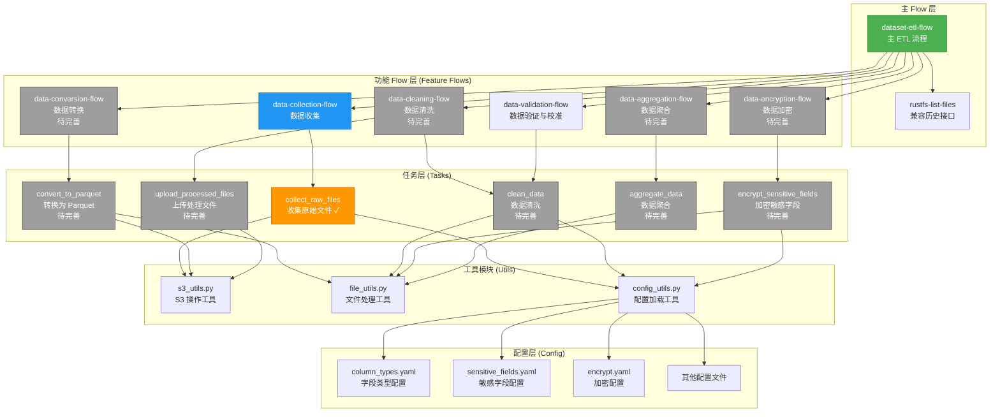
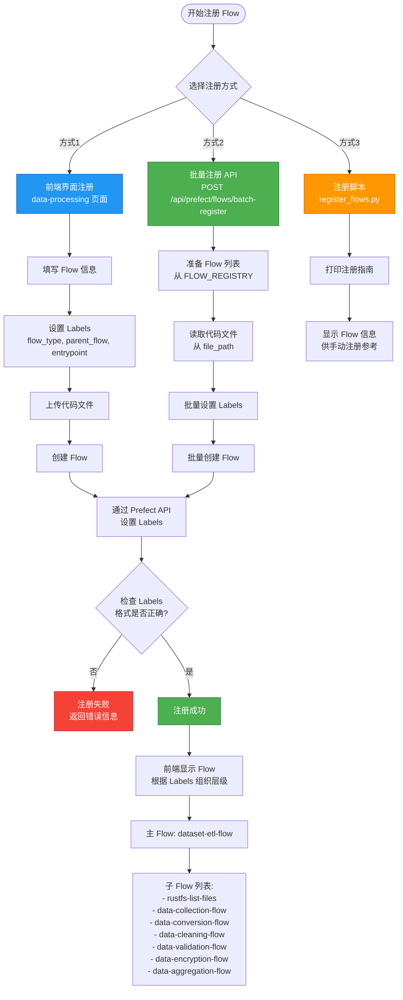
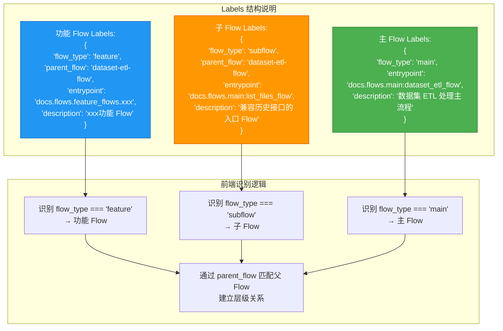
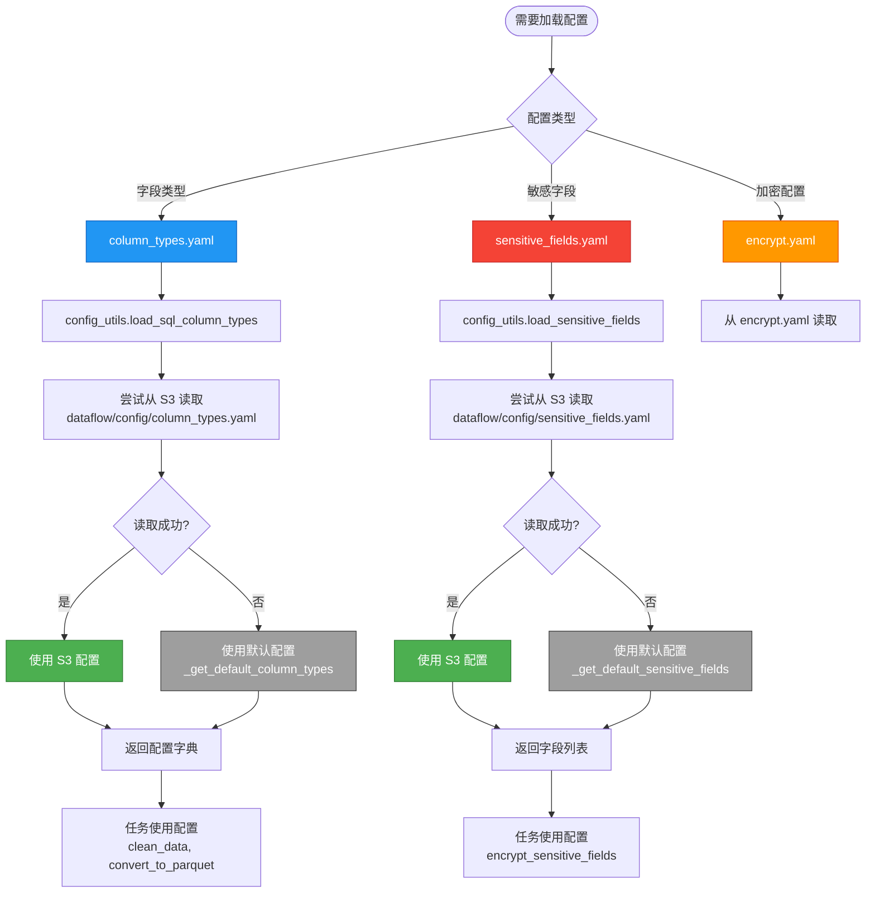
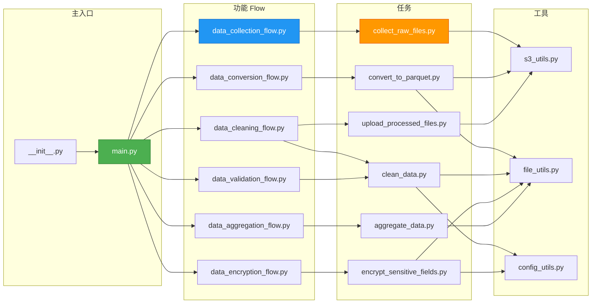

# Flow 流程架构图

## 1. 整体架构图



## 2. 执行流程图（数据流转）

```mermaid
flowchart TD
    Start([开始: 传入 prefix<br/>例如: team-1/dataset-2/sourcedata/]) --> MainFlow

    MainFlow[dataset-etl-flow<br/>主流程入口] --> Step1

    Step1[步骤1: data-collection-flow<br/>数据收集] --> CollectTask[collect_raw_files Task]
    CollectTask --> S3List[S3 列出文件<br/>list_objects folder=prefix]
    S3List --> FilterFiles[过滤文件<br/>仅保留 .csv/.xlsx/.xls]
    FilterFiles --> UploadedFiles[生成 uploaded_files 列表<br/>包含 relative_path, target_key, bucket]
    UploadedFiles --> Step2

    Step2[步骤2: data-conversion-flow<br/>数据转换<br/>⏳ 待完善] --> ConvertTask[convert_to_parquet Task]
    ConvertTask --> ReadData[读取 CSV/Excel<br/>转换为 DataFrame]
    ReadData --> WriteParquet[写入 Parquet 格式<br/>输出到 raw_extracted 区]
    WriteParquet --> ParquetFiles[生成 parquet_files 列表]
    ParquetFiles --> Step3

    Step3[步骤3: data-cleaning-flow<br/>数据清洗<br/>⏳ 待完善] --> CleanTask[clean_data Task]
    CleanTask --> LoadConfig1[加载配置<br/>column_types.yaml]
    LoadConfig1 --> NormalizeTypes[规范数据类型<br/>DECIMAL/INTEGER/TEXT/BOOLEAN]
    NormalizeTypes --> HandleMissing[处理缺失值]
    HandleMissing --> CleanedFiles[生成 cleaned_files 列表]
    CleanedFiles --> Step3_5

    Step3_5[步骤3.5: data-validation-flow<br/>数据验证与校准] --> ValidationTask[验证逻辑]
    ValidationTask --> BuildAuth[构建权威表<br/>从 611/601 表]
    BuildAuth --> MatchCode[通过 code/name 匹配校准]
    MatchCode --> DetectIssues[检测问题<br/>code截断/一对多/缺失code]
    DetectIssues --> HasIssues{是否<br/>有问题?}
    HasIssues -->|是| WaitFix[暂停等待<br/>用户修复]
    WaitFix --> HasIssues
    HasIssues -->|否| ValidatedFiles[生成 validated_files 列表]
    ValidatedFiles --> Step4

    Step4[步骤4: data-encryption-flow<br/>数据加密<br/>⏳ 待完善] --> EncryptTask[encrypt_sensitive_fields Task]
    EncryptTask --> LoadConfig2[加载配置<br/>sensitive_fields.yaml]
    LoadConfig2 --> EncryptFields[加密敏感字段<br/>使用 SM2 加密]
    EncryptFields --> SecureFiles[生成 secure_files 列表]
    SecureFiles --> Step5

    Step5[步骤5: data-aggregation-flow<br/>数据聚合<br/>⏳ 待完善] --> AggregateTask[aggregate_data Task]
    AggregateTask --> Aggregate[数据汇总统计]
    Aggregate --> UploadTask[upload_processed_files Task]
    UploadTask --> UploadS3[上传处理后的文件到 S3]
    UploadS3 --> FinalResult[生成最终结果]

    FinalResult --> End([结束: 返回处理结果])

    style Step1 fill:#4CAF50,stroke:#2E7D32,color:#fff
    style Step2 fill:#9E9E9E,stroke:#424242,color:#fff
    style Step3 fill:#9E9E9E,stroke:#424242,color:#fff
    style Step3_5 fill:#2196F3,stroke:#1565C0,color:#fff
    style Step4 fill:#9E9E9E,stroke:#424242,color:#fff
    style Step5 fill:#9E9E9E,stroke:#424242,color:#fff
```



## 3. Flow 注册流程图



## 4. Labels 层级关系图



## 5. 配置文件使用流程图



## 6. 模块依赖关系图



## 说明

### 状态说明
- ✅ **绿色**: 已实现
- ⏳ **灰色**: 待完善（代码框架已创建，需要迁移实现）
- 🔵 **蓝色**: 部分实现或核心功能

### 关键概念

1. **主 Flow**: 整个 ETL 流程的入口，协调所有功能 Flow
2. **功能 Flow**: 将相关的任务组合成完整的功能单元
3. **任务 (Task)**: 最小的执行单元，负责单一职责
4. **工具模块**: 可复用的工具函数，被任务调用
5. **配置层**: 外部配置文件，支持动态加载和默认值回退

### 数据流转

```
prefix (输入)
  ↓
uploaded_files (收集的文件列表)
  ↓
parquet_files (Parquet 格式文件列表)
  ↓
cleaned_files (清洗后的文件列表)
  ↓
validated_files (验证后的文件列表)
  ↓
secure_files (加密后的文件列表)
  ↓
最终结果 (聚合统计结果)
```

### 配置加载优先级

1. **S3 配置**: 从 `dataflow/config/` 读取（优先级最高）
2. **默认配置**: 如果 S3 配置不存在，使用代码内嵌的默认配置

